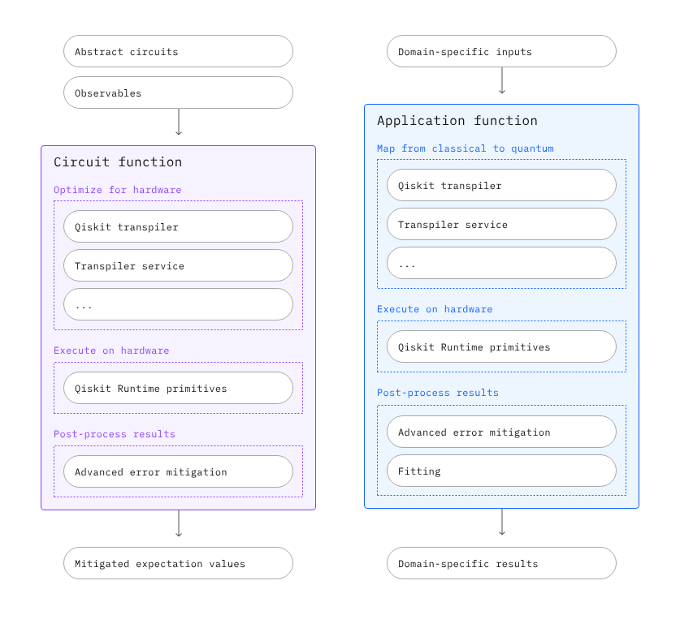

 

# Qiskit Function Templates

### Table of contents

* [About](#about)
* [Contributing](#contributing)
* [License](#license)

----------------------------------------------------------------------------------------------------

### About

This repository hosts Qiskit Function templates and template implementations powered by [`qiskit`](https://github.com/Qiskit/qiskit) and [`qiskit-serverless`](https://github.com/Qiskit/qiskit-serverless).

Template implementations are realistic examples of how to build utility-scale application workflows with [Qiskit](https://docs.quantum.ibm.com/guides) and [Qiskit Addons](https://docs.quantum.ibm.com/guides/addons). Spanning across application domains, these are starter kits that you can customize for your own research needs instead of starting from scratch. And they are easily deployable to [Qiskit Serverless](https://docs.quantum.ibm.com/guides/serverless) for managed execution.

The base templates are references you can use for developing custom [Qiskit Functions](https://docs.quantum.ibm.com/guides/functions) using recommended best practices.

#### Base Templates
Qiskit Function *base templates* allow to kickstart the [Qiskit Function](https://docs.quantum.ibm.com/guides/functions) development process with best-practices in interface development, code formatting, unit testing, and more. The repository itself is exposed as a [GitHub template](https://docs.github.com/en/repositories/creating-and-managing-repositories/creating-a-template-repository), so the CI/CD implementation can be easily extended by implementers to match new projects.

There are currently two templates: a circuit function template and an application function template.

<!--  -->

#### Application Template Implementations
Qiskit Function *template implementations* show different realizations of the application function template above that leverage [Qiskit Addons](https://docs.quantum.ibm.com/guides/addons) to run industry-relevant application workflows. These implementations are structured by application area, currently:

- `physics`
- `chemistry`

Each implementation is contained in a directory in the corresponding application area, for example, for the hamiltonian simulation function: [`physics/hamiltonian_simulation/hamiltonian_simulation.py`](https://github.com/qiskit-community/qiskit-function-templates/blob/main/physics/hamiltonian_simulation/hamiltonian_simulation.py). The directory might contain additional files that can be uploaded to the serverless environment for the function execution.

For convenience, we provide direct download links for each application template directory:

- [Download Hamiltonian Simulation template](https://download-directory.github.io/?url=https%3A%2F%2Fgithub.com%2Fqiskit-community%2Fqiskit-function-templates%2Ftree%2Fmain%2Fphysics%2Fhamiltonian_simulation)

----------------------------------------------------------------------------------------------------

### Documentation

All documentation is available at [TBD].

----------------------------------------------------------------------------------------------------

### Contributing

The source code is available [on GitHub](https://github.com/Qiskit/qiskit-function-templates).

The developer guide is located at [CONTRIBUTING.md](https://github.com/Qiskit/qiskit-function-templates/blob/main/CONTRIBUTING.md)
in the root of this project's repository.
By participating, you are expected to uphold Qiskit's [code of conduct](https://github.com/Qiskit/qiskit/blob/main/CODE_OF_CONDUCT.md).

We use [GitHub issues](https://github.com/Qiskit/qiskit-function-templates/issues/new/choose) for tracking requests and bugs.

----------------------------------------------------------------------------------------------------

### License

[Apache License 2.0](LICENSE.txt)